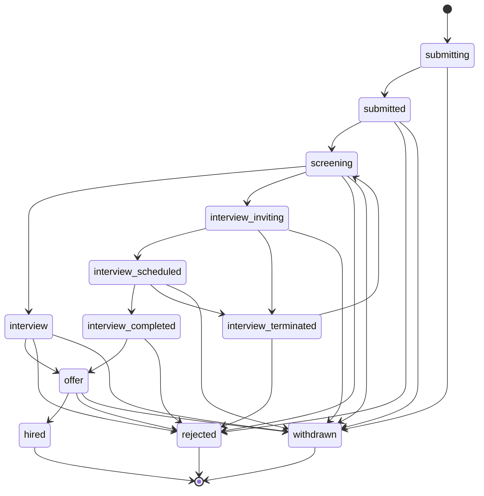

# Module B：职位申请状态机（`application_status.js`）

`APPLICATION_STATUS` 共 **12** 个状态值，与 `getNextPossibleStatuses()` 定义的合法迁移一致。

## 状态一览

| 枚举键 | 值 | 说明 |
|--------|-----|------|
| SUBMITTING | `submitting` | 申请中（两步流程第一步） |
| SUBMITTED | `submitted` | 已提交（两步流程第二步） |
| SCREENING | `screening` | 筛选中 / 待邀请 |
| INTERVIEW | `interview` | 面试阶段（兼容旧数据） |
| INTERVIEW_INVITING | `interview_inviting` | 邀约中 |
| INTERVIEW_SCHEDULED | `interview_scheduled` | 待面试 |
| INTERVIEW_COMPLETED | `interview_completed` | 已面试 |
| INTERVIEW_TERMINATED | `interview_terminated` | 已终止 |
| OFFER | `offer` | Offer 阶段 |
| HIRED | `hired` | 已录用 |
| REJECTED | `rejected` | 已拒绝 |
| WITHDRAWN | `withdrawn` | 已撤回 |

## 终态（`getNextPossibleStatuses` 返回空数组）

- `hired`
- `rejected`
- `withdrawn`

## Mermaid 状态图（合法迁移）

## 两步提交流程（与 `ApplicationService.createApplication`）

| 步骤 | 条件 | 状态 |
|------|------|------|
| 第一次调用 | 无有效历史申请 | 新建 `submitting` |
| 第二次调用 | 已存在同 job+candidate 且状态为 `submitting`，且 `resolvedHasResume && hasAssessment` | 更新为 `submitted` |

> 说明：`submitted → screening` 等后续迁移通常由评估轮询、B 端操作等触发，不在 `createApplication` 内一次性完成。

## 面试子阶段

细分状态：`interview_inviting` → `interview_scheduled` → `interview_completed`，或终止到 `interview_terminated`；兼容路径仍保留聚合状态 `interview`。
